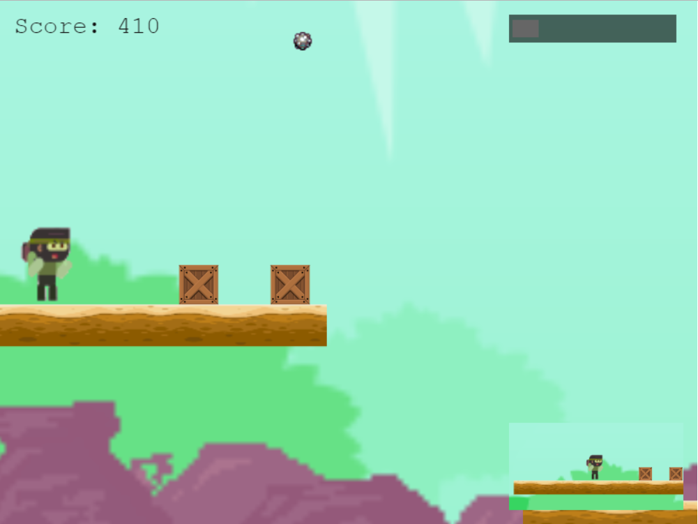

# Phaser-Ninja-Platformer
​A sample game based on modified getting started tutorial. It implements minimap , unity cinecamera like movement, different hud &amp; game layers, custom collision box, button events, mouse click bullets with physics etc.

This can be played here:
https://quickgrid.itch.io/ninja-sample

Movement done with arrow keys. O and P keys are used for some fight animations which are not implemented and finally mouse click will shoot cats.

